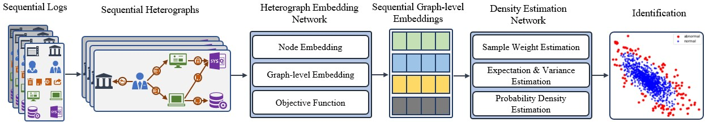

# HenDen: An Operational Logic Heterograph-based Unsupervised Framework for Identifying Financial Operational Risks
## Introduction
HeDen is an operational logic heterograph-based learning framework for recognizing financial operational risks without labeled data. In this framework, we first represent the operational logic of bank employees via using heterographs. Next, we propose the HEN to learn the structural information and meta relations in the operational logic heterographs and encode each entire graph into a low-dimension vector. Finally, the DEN is introduced to identify operational risks based on the probability density distributions. In addition, the HEN and DEN are trained in an end-to-end manner via a joint training strategy to select the vital information for detecting risks.

## Install
HenDen is built on pytorch and DGL. To train and test
HenDen, the following dependencies should be first installed.
+ torch  1.10.2
+ dgl 0.6.1
+ numpy 1.15.0
+ math 1.0.0
+ matplotlib 2.2.2

The following command line are executed to obtain our source code.

```bash
git clone git@github.com:flying-chicks/operation-risk-detection.git
```

## Usage
The file *sim_train.py* is used to execute training on the synthetic data.
The file *syn_data.py* is used to generate synthetic data.
The example data and labels *data/data_and_labels.pkl* are saved on <a href='https://pan.baidu.com/s/1Xud6JqcEMOH064Wqq_8K0g?pwd=348x'></a> 
and can be loaded through the following code.

```python
import pickle as pkl
with open('data/data_and_labels.pkl', mode='rb') as fr:
    data = pkl.load(fr)
example_data = data[0][0]
labels = data[2][0]
```
The trained model parameters are saved in *trained_models/graph_seq_model-epochs_100-sem_0.7347-str_3.7828-energy_0.5918-loss_weight_0.7104.pt*,
which can be loaded through the following code.
```python
import torch
trained_file = 'trained_models/graph_seq_model-epochs_100-sem_0.7347-str_3.7828-energy_0.5918-loss_weight_0.7104.pt'
embedding_model = torch.load(trained_file)
```

The following code can be used to train model from scratch.
```python
from models import GraphSeqEmbeddingModel
from utils import gen_graph_pairs
import warnings
warnings.filterwarnings("ignore")

graph_seq = list(example_data.values())

embedding_model = GraphSeqEmbeddingModel()
contrastive_pairs = []
for graph in graph_seq:
    contrastive_pairs.append(gen_graph_pairs(graph))
embedding_model.train(graph_seq, contrastive_pairs, calc_energy=True)
```